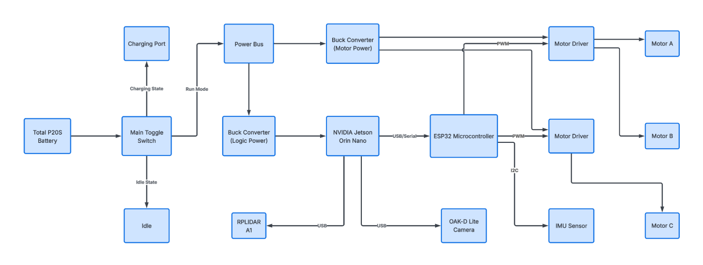
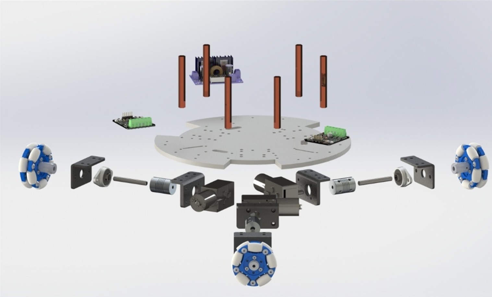
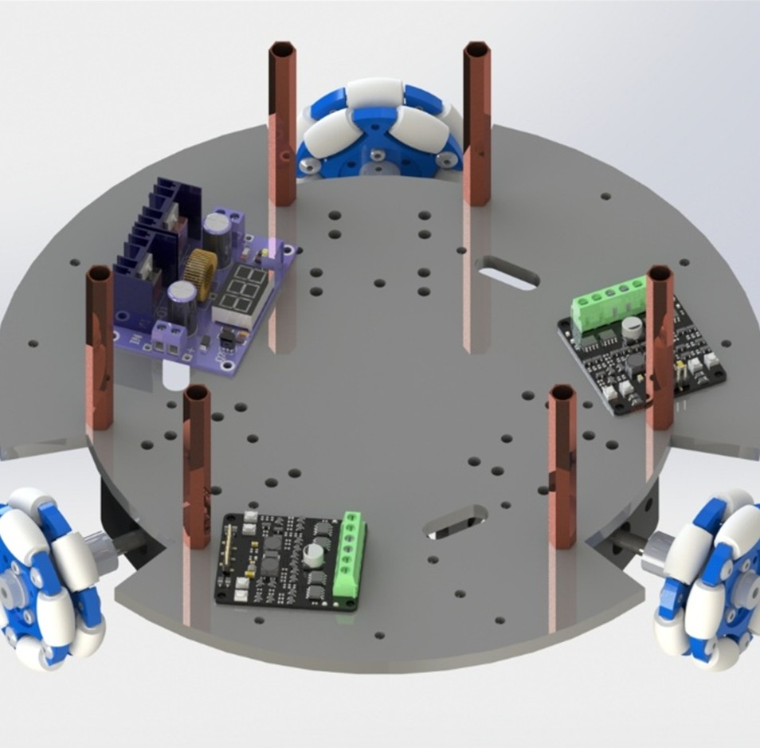
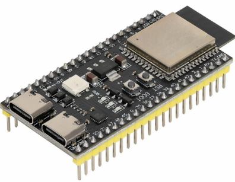
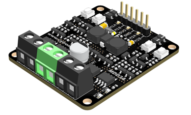
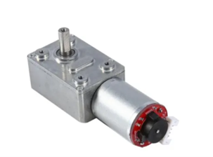
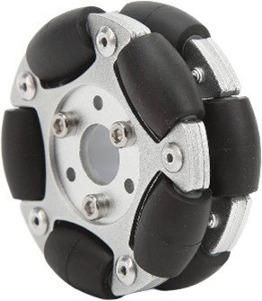
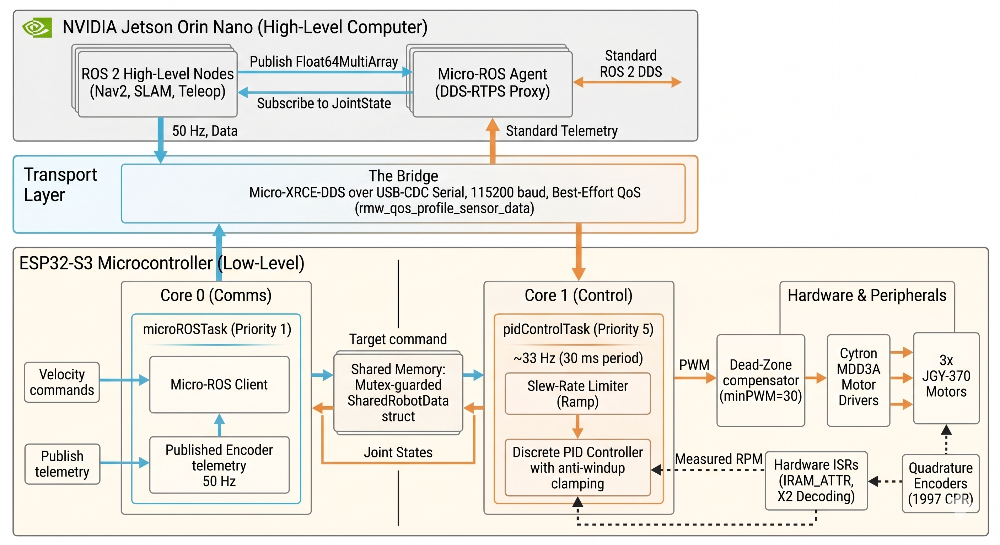
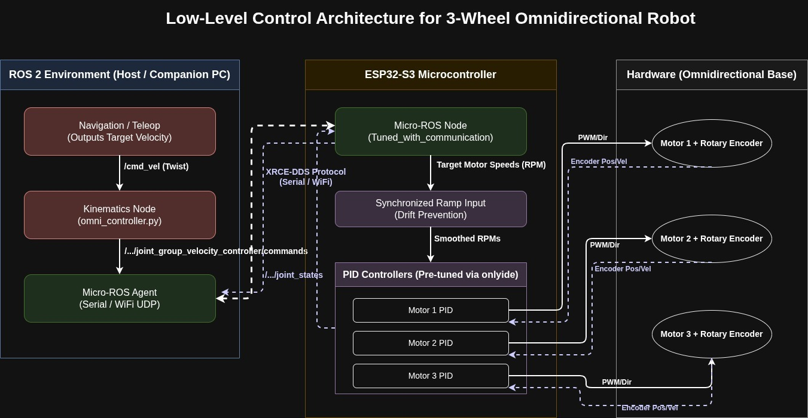

# Low-Level Control for 3-Wheel Omnidirectional Robot

[](https://docs.ros.org/en/humble/)
[](https://micro.ros.org/)
[](https://www.espressif.com/en/products/socs/esp32-s3)
[](https://www.freertos.org/)
[](https://isocpp.org/)

This repository contains the complete low-level control firmware, ROS 2 interface nodes, tuning environments, and deployment scripts for the **AUSRA** team's 3-wheel omnidirectional mobile robot platform.

The system acts as the real-time embedded **"Spine"** of the robot, executing closed-loop PID motor velocity control, quadrature encoder feedback, low-pass signal filtering, acceleration ramp limiting, and Micro-ROS communication over USB-serial or UDP/WiFi.

---

## 1. System Architecture & Hardware Setup

### Hierarchical Control Split

The robot decouples high-level AI computing from time-critical motor actuation:
- **High-Level "Brain":** NVIDIA Jetson Orin Nano (SLAM, path planning, computer vision).
- **Low-Level "Spine":** ESP32-S3 Microcontroller (inverse kinematics, PID control, encoder feedback).

<p align="center">
  
</p>

---

### Real Hardware Assembly

| Locomotion Base Plate | Middle Layer Control Hub |
| :---: | :---: |
|  |  |
| *Bottom tier: 3 omni-wheels, JGY-370 motors & Cytron MDD3A drivers.* | *Middle tier: ESP32-S3 MCU, power management & signal isolation.* |

---

### Hardware Specs & Pinout Mapping

| Microcontroller | Motor Driver | DC Gearmotor & Encoder | Omnidirectional Wheel |
| :---: | :---: | :---: | :---: |
|  |  |  |  |
| **ESP32-S3** (Dual-Core) | **Cytron MDD3A** (3A MOSFET) | **JGY-370** (12V DC Motor) | **58mm** Omni Wheel |

#### Pinout Assignment (`Config.h`)

| Motor Channel | Wheel Location | PWM Pin A (`IN_A`) | PWM Pin B (`IN_B`) | Encoder A (`ENC_A`) | Encoder B (`ENC_B`) |
| :--- | :--- | :---: | :---: | :---: | :---: |
| **Motor 1** | Camera Side (90°) | GPIO 4 | GPIO 5 | GPIO 17 | GPIO 18 |
| **Motor 2** | Charger Side (210°) | GPIO 8 | GPIO 9 | GPIO 35 | GPIO 21 |
| **Motor 3** | Switch Side (330°) | GPIO 6 | GPIO 7 | GPIO 2 | GPIO 1 |

---

## 2. Low-Level Control & PID Implementation

The firmware implements robust motor velocity control designed to keep the robot moving smoothly and accurately:

### ⚡ Fast Encoder Interrupts & Calibration
- Encoder interrupts run directly in fast internal SRAM (`IRAM_ATTR`), eliminating execution lag.
- Uses **X2 decoding** to cut CPU interrupt overhead in half (~30k calls/sec at 300 RPM).
- Measured Resolution: **1,997 counts per revolution** (`TOTAL_CPR = 1997.0`).

### 🌊 Low-Pass Filter (Noise Reduction)
- Raw encoder signals introduce high-frequency jitter at small time intervals.
- An **Exponential Moving Average (EMA)** filter ($\alpha = 0.45$) smooths the velocity readings, preventing motor humming and derivative spikes.

### 🎯 Discrete PID Control & Anti-Windup
- Calculates motor power every 30 ms ($\approx 33\text{ Hz}$) based on setpoint RPM error.
- Bounded **Anti-Windup Clamp** ($[-75, +75]$) hard-limits the integral accumulator. If a wheel gets physically blocked, the controller recovers instantly when freed rather than overshooting.

### 🚗 Deadzone & Acceleration Ramp
- **Deadzone Remapping:** Maps commands above static friction breakaway (`minPWM = 30`) so motors respond instantly at low speeds.
- **Synchronized Acceleration Ramp:** Ramps setpoints evenly across all 3 wheels ($50\text{ RPM/s}$) so the robot speeds up smoothly without veering or spinning off-course.

### 📊 Deployed PID Parameters

- **$K_p = 10.0$** | **$K_i = 10.0$** | **$K_d = 0.01$**
- **Breakaway PWM (`minPWM`):** $30$
- **Ramp Acceleration Limit (`MAX_ACCEL`):** $50.0\text{ RPM/s}^2$
- **Low-Pass Filter Alpha (`LPF_ALPHA`):** $0.45$

---

## 3. Real-Time FreeRTOS & Micro-ROS System

### Dual-Core Task Allocation

The firmware runs on FreeRTOS to guarantee strict time separation across the ESP32-S3's dual cores:

<p align="center">
  
</p>

- **Core 0 (`microROSTask`):** Services ROS 2 communication and telemetry publishing at 50 Hz.
- **Core 1 (`pidControlTask`):** Executes the strict real-time 33 Hz PID control loop.
- Tasks share state using a mutex-protected buffer so communication delays never freeze motor control.

### Micro-ROS Client-Agent Bridge

<p align="center">
  
</p>

Micro-ROS bridges the ESP32-S3 directly to the ROS 2 graph over USB-CDC serial (115200 baud) using Best-Effort QoS for low latency (<50 KB RAM footprint).

---

## 4. Repository Structure

```
low-level/
├── docs/images/                              # System diagrams & hardware showcase photos
├── FREERTOS/                                 # Production dual-core FreeRTOS firmware
│   ├── FREERTOS.ino                         # Main sketch splitting ROS and PID tasks
│   ├── Config.h                             # Pin assignments & physical parameters
│   ├── Motor.cpp / Motor.h                  # Driver control with deadzone mapping
│   └── PIDController.cpp / PIDController.h  # Low-pass filtered PID with anti-windup
├── Tuned_with_Commnunication/                # Production Serial Micro-ROS template
├── Wifi_Teleop/                             # Wireless UDP Micro-ROS template
├── onlyide/                                  # Interactive live PID calibration environment
├── scripts/
│   └── start_micro_ros_agent.sh             # Automated launcher with namespace injection
├── omni_controller.py                        # Inverse kinematics ROS 2 node (/cmd_vel -> wheels)
└── README.md                                 # Main documentation
```

---

## 5. Workflows & Quick Start

### Prerequisites

1. **Host PC / Jetson:** ROS 2 Humble installed.
2. **Micro-ROS Agent Workspace:**
   ```bash
   mkdir -p ~/microros_ws/src && cd ~/microros_ws/src
   git clone -b humble https://github.com/micro-ROS/micro_ros_setup.git
   cd ~/microros_ws && colcon build && source install/local_setup.bash
   ros2 run micro_ros_setup create_agent_ws.sh
   ros2 run micro_ros_setup build_agent.sh
   source install/local_setup.bash
   ```

---

### Workflow 1: Production Launch (Automated Script)

Runs the serial agent with dynamic hardware namespace assignment (`ns:<robot_namespace>`):

```bash
chmod +x scripts/start_micro_ros_agent.sh
./scripts/start_micro_ros_agent.sh ausra_1
```

---

### Workflow 2: Inverse Kinematics & Keyboard Teleop

In separate ROS 2 terminals:

1. **Run Inverse Kinematics Node:**
   ```bash
   python3 omni_controller.py
   ```
2. **Run Keyboard Teleop:**
   ```bash
   ros2 run teleop_twist_keyboard teleop_twist_keyboard
   ```
3. **Check Topics:**
   ```bash
   ros2 topic echo /ausra_1/joint_group_velocity_controller/commands
   ros2 topic echo /ausra_1/joint_states
   ```

---

### Workflow 3: Live Interactive PID Tuning (`onlyide`)

1. Flash `onlyide/TripleMotorControl` to the ESP32-S3.
2. Open Serial Plotter at 115200 baud.
3. Send tuning commands:
   ```text
   SA 100   # Set all 3 motors to 100 RPM
   P1 20    # Set Motor 1 Kp to 20
   I1 0.5   # Set Motor 1 Ki to 0.5
   D1 0.1   # Set Motor 1 Kd to 0.1
   ```

---

## 6. ROS 2 Topics & Troubleshooting

| Topic Name | Message Type | Direction | Description |
| :--- | :--- | :---: | :--- |
| `/cmd_vel` | `geometry_msgs/msg/Twist` | Sub | Target linear ($v_x, v_y$) and angular ($\omega_z$) velocity |
| `/<ns>/joint_group_velocity_controller/commands` | `std_msgs/msg/Float64MultiArray` | Sub | Target wheel RPM array `[m1, m2, m3]` sent to ESP32 |
| `/<ns>/joint_states` | `sensor_msgs/msg/JointState` | Pub | Real-time motor encoder positions and RPM feedback |

### Troubleshooting
- **Serial Permission Denied:** Run `sudo usermod -a -G dialout $USER` then log out and back in.
- **Agent Connection Timeout:** Use `./scripts/start_micro_ros_agent.sh` to trigger the required DTR reset pulse.